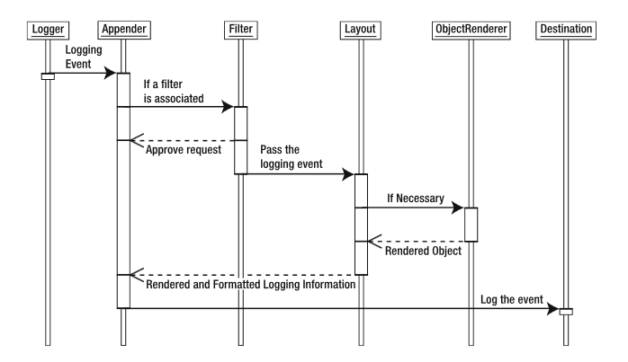

#Log4j 1.x

##Log4j简介
Log4j是一种分层结构：  
　　最顶层： 捕获log信息  
　　中间层：分析和验证log信息  
　　最底层：格式化生成log信息

##Log4j的三大组件
1. Loggers 日志写出器，捕获log信息
2. Appenders 日志目的地，将log信息输出到不同的目的地
3. Layouts 日志格式化，格式化log信息

##Log4j其他重要组件
1. Level: 老版本中称之为Priority，用于定义log信息的级别。每一条log信息都拥有一个合适的Level。Log4j中定义了7种Level，分别是：OFF，DEBUG，INFO，ERROR，WARN，FATAL，ALL。每种Level都对应一个整型数值。Level之间的优先关系为：ALL<DEBUG<INFO<WARN<ERROR<FATAL<OFF。
2. Filter：用于分析log信息并决定哪些信息将被输出。Filter附属于Appender存在，并且一个Appender对象可以绑定多个Filter。
3. ObjectRender：使用相应的字符串来表示传递给Log4j的（自定义）对象（例：toString()），附属于Layout。
4. LogManager：负责管理整个框架。包括读取初始化参数，Logger对象的创建。

	
##Log4j初始化
###默认初始化过程
LogManager通过静态代码块加载配置参数，生成Logger单实例对象。过程如下：  
　　- LogManager 查找系统属性log4j.configuration（可以自定义参数文件路径）  
　　- 如果没有定义log4j.configuration，则在当前ClassPath中查找log4j.properties/log4j.xml  
　　- 将参数信息字符串转化为java.net.URL对象  
　　- 如果没有找到配置参数，初始化过程将会终止  
　　- 如果找到配置文件，根据文件格式，使用对应的org.apache.log4j.PropertyConfigurator/org.apache.log4j.xml.DOMConfigurator解析.properities/.xml格式配置文件，生成Logger对象  
Log4j支持自定义初始化器（如：LogManager）以及自定义配置文件解析器（如：PropertyConfigurator），自定义配置文件解析类应当实现org.apache.log4j.spi.Configurator接口，并且在程序启动时通过log4j.configurationClas指定自定义解析器
###通过 VM参数初始化
Log4j在初始化过程中支持3个VM参数：  
　　- log4j.configuration：指定配置文件  
　　- log4j.configurationClass：指定自定义初始化类代替LogManager。通过log4j:defaultInitOverride启用（禁用）默认初始化流程

##详解		
### 1 Loggers
#### 1.1 Loggers级别设置
在org.apache.log4j.Level中定义了以下级别  
　　1. TRACE  
　　2. DEBUG  
　　3. INFO  
　　4. WARN  
　　5. ERROR  
　　6. FATAL  
我们可以通过继承org.apache.log4j.Level这个类来自定义级别(不推荐)
	
#### 1.2 Loggers 继承关系
如果一个Logger没有明确指定级别，它的级别将从最近的指定级别的祖先类继承。
为了保证每个类都能继承到级别，作为最顶层logger，root logger通常需要明确的指定级别。
#### 1.3 Loggers 级别关系
FATAL>ERROR>WARN>INFO>DEBUG  
Log4j通过调用debug，info，warn，error，fatal，log等方法生成log信息。不同的打印方法对应不同的级别。例如：logger.info("xxx")对应INFO级别。  
基本原则：  
　　当打印级别 >= logger的级别时，log信息才会被打印  
例如：  
　　logger 级别: INFO  
　　打印方法级别：DEBUG 不打印（DEBUG < INFO）  
　　打印方法级别：INFO 打印（INFO >= INFO）  
　　打印方法级别：ERROR 打印（ERROR > INFO）  

#### 1.4 Loggers的名称
Loggers的名称具有全局唯一性，通过getLogger方法获取相同名称的logger实例，得到的将是同一个logger的引用。  
通过类的权限定名称来命名logger是个比较好的命名策略。

### 2 Appenders
Log4j支持将log打印到不同的目的地中，包括：Console，File，GUI组件，远程socket服务器，JMS, NT Event Loggers等，并且支持异步打印日志。  
一个Logger身上可以绑定多个Appender。并且Appender也会跟随Logger的继承关系叠加下去。可以通过设置logger的additivity属性，改变appender的叠加性。  
一个logger会将日志信息打印到其自身及其祖先所绑定的所有appender去。如果其祖先中某个logger设置了additivity：false，与该logger祖先相关的appender将不会被考虑在内。  

### 3 Layouts
Layouts用于格式化输出。

### 4 参数配置
Log4j通过参数文件来配置Logger，Appender，Layout的基本信息。支持.properities, .xml以及程序三种方式来进行相关设置。但：  
　　- Log4j 配置是大小写敏感的  
　　- 某些Appender组件，比如：AsyncAppender只能通过xml形式配置  
　　- 某些高级组件，比如：Filter，ObjectRenderer只能通过xml形式配置  
#### 4.1 配置文件的基本组成元素
##### 4.1.1 Logger的配置
- level：fatal，error，warn，info，debug  
- AppenderName1，AppenderName2...  
例如：log4j.rootLogger=[level],AppenderName1,AppenderName2...

##### 4.1.2 Appender的配置
- name
- class：Appender的全限定类名，Log4j提供的Appender有以下几种：
	-  org.apache.log4j.ConsoleAppender 输出到控制台
		- threshold 输出日志消息的最低级别，默认ALL
		- immediateFlush 是否立即输出，默认true
		- target 指定输出位置，默认System.out
	-  org.apache.log4j.FileAppender 输出到文件中
		- threshold 输出日志消息的最低级别，默认ALL
		- immediateFlush 是否立即输出，默认true
		- file 指定消息输出的文件路径
		- append 追加或覆盖消息，默认为true
	-  org.apache.log4j.DailyRollingFileAppender 周期产生一个日志文件
		- 同FileAppender
		- datePattern 
	-  org.apache.log4j.RollingFileAppender 文件大小达到指定大小生成新文件
		- 同FileAppender
		- maxFileSize 文件大小最大值，单位可以是KB, MB, GB
		- maxBackupIndex 可以滚动文件的最大数
	-  org.apache.log4j.WriterAppender 以流的形式输出到任何地方
- param：param1，param2...
- layout：见下面layout配置 

##### 4.1.3 Layout的配置
- class：Layout的全限定类名，Log4j提供的Layout有以下几种：
	- org.apache.log4j.HTMLLayout 以HTML表格形式布局
	- org.apache.log4j.PatternLayout 根据Pattern灵活地指定布局模式
		- %m   输出代码中指定的消息
		- %p   输出优先级，即DEBUG，INFO，WARN，ERROR，FATAL
		- %r   输出自应用启动到输出该log信息耗费的毫秒数
		- %c   输出所属的类目，通常就是所在类的全名
		- %t   输出产生该日志事件的线程名
		- %n   输出一个回车换行符，Windows平台为"/r/n"，Unix平台为"/n"
		- %d   输出日志时间点的日期或时间，默认格式为ISO8601，也可以在其后指定格式，比如：%d{yyy MMM dd HH:mm:ss , SSS}
		- %l   输出日志事件的发生位置，包括类目名、发生的线程，以及在代码中的行数。举例：Testlog4.main(TestLog4.java: 10 )
	- org.apache.log4j.SimpleLayout 包含日志信息的级别和信息字符串
	- org.apache.log4j.TTCCLayout 包含日志产生的时间、线程、类别等等信息

